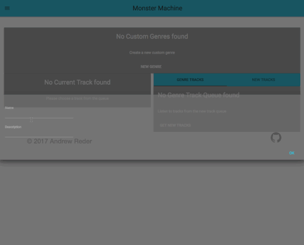
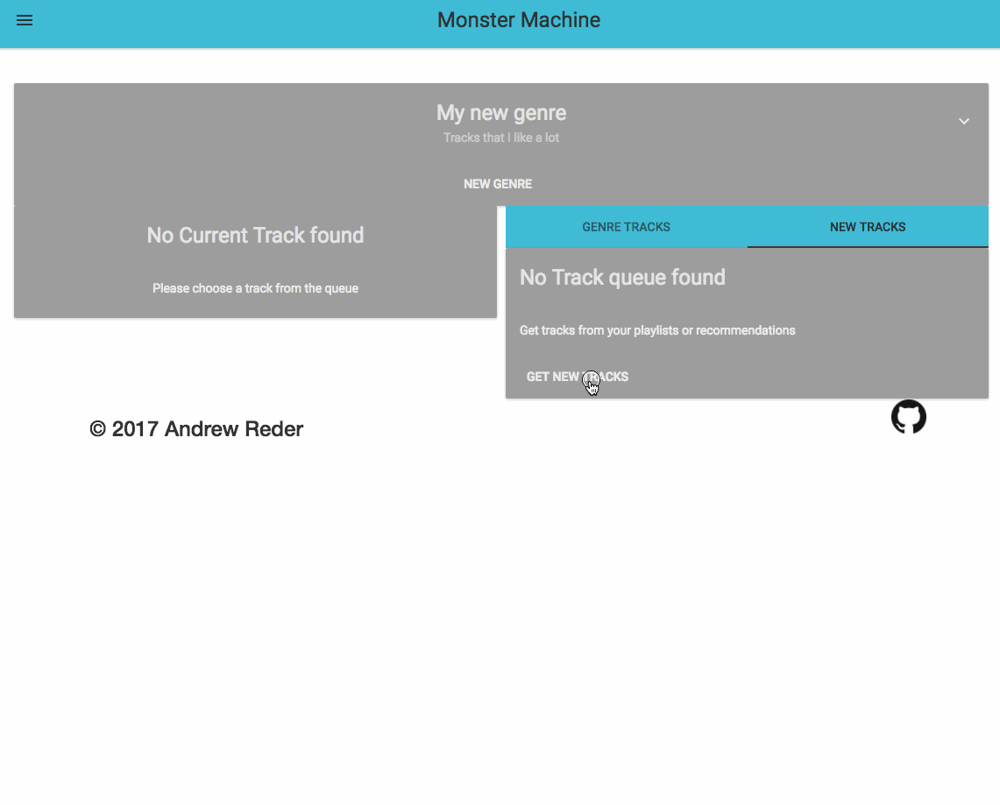
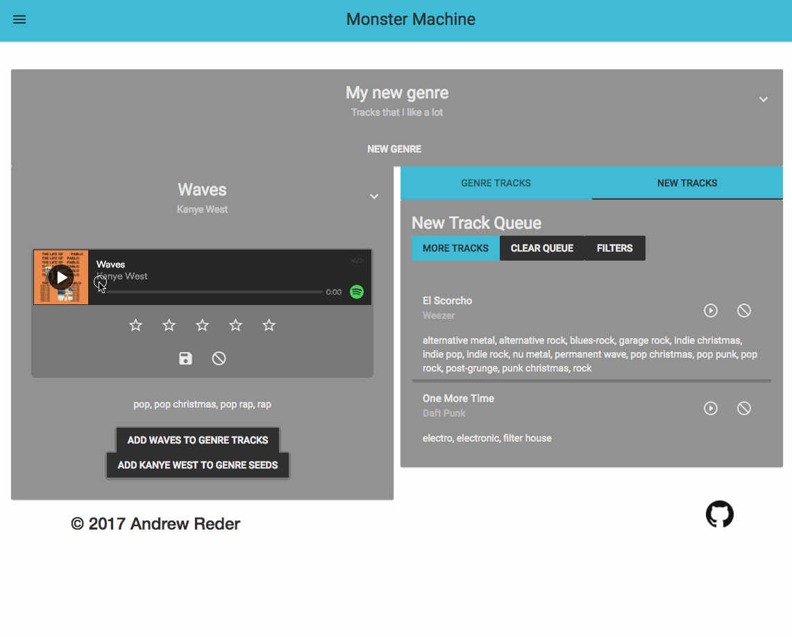
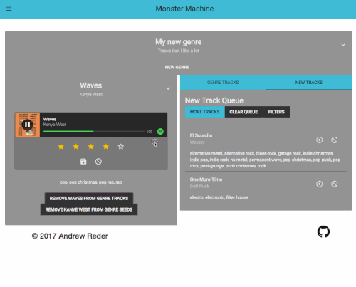
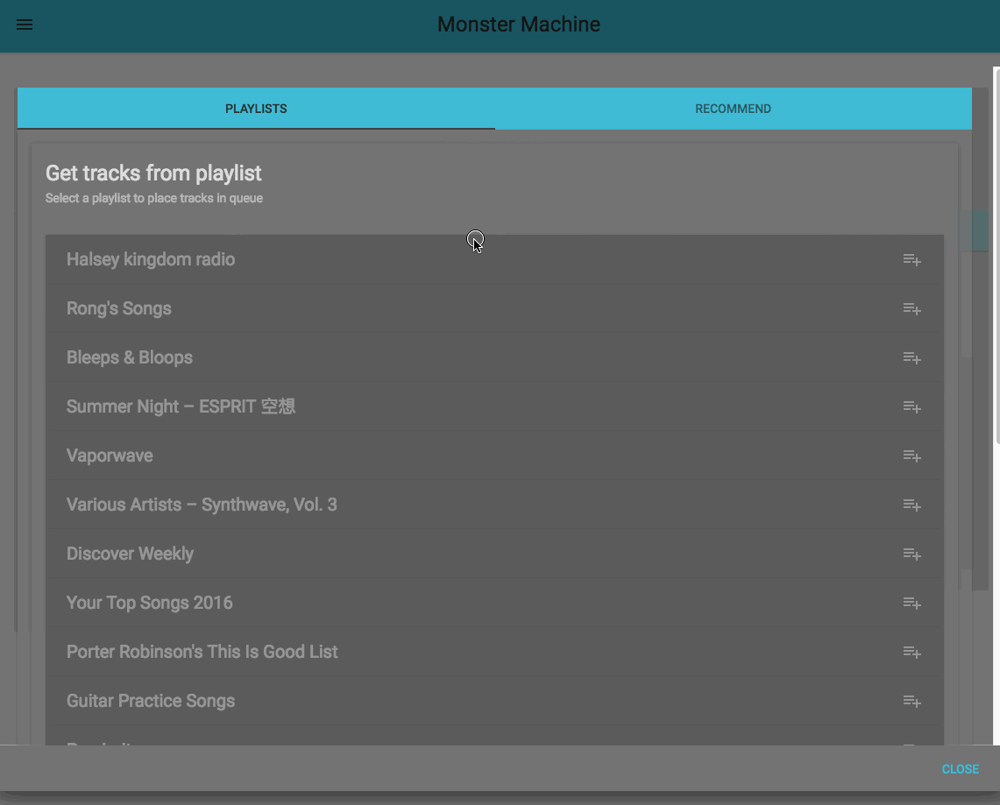
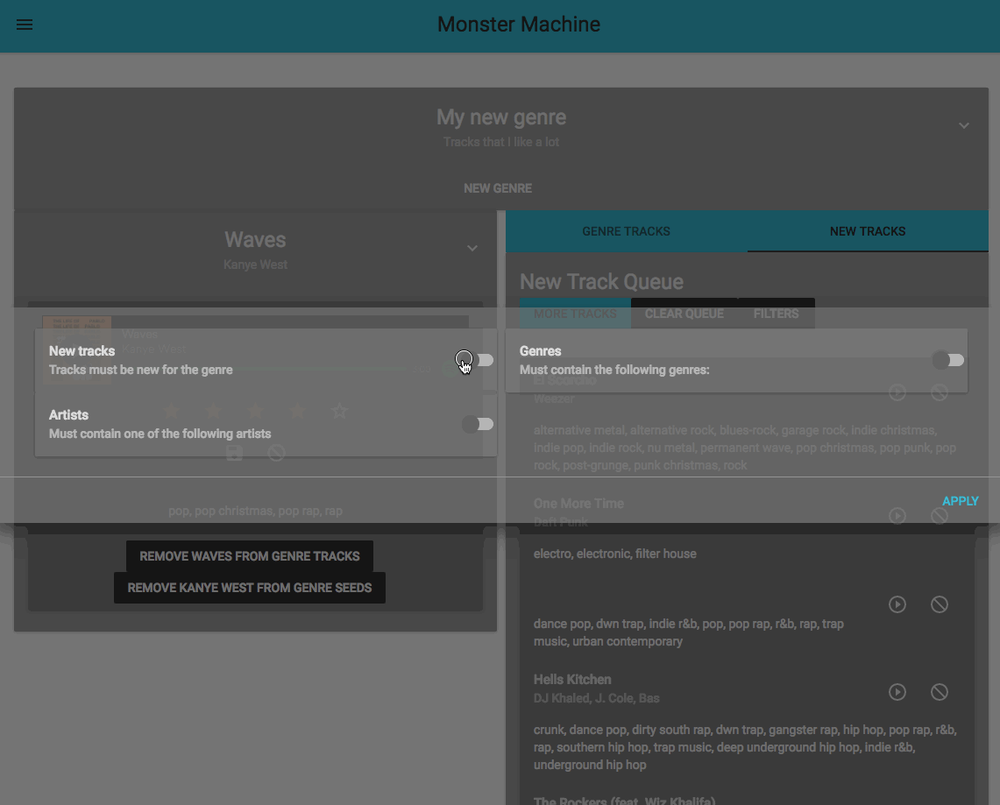

# Monster Machine Client

Monster machine is a tool that leverages the Spotify Web API to help you quickly find recommended songs. It is designed for you to create a "genre" of music, seed it with artists or songs, and Monster Machine will generate a track list for you.

Feel free to use it at https://monmach.com, though it is under active development, so beware, there be bugs.

### Create a new genre

### Add tracks to your queue
#### Use existing Spotify playlist as a starting point

### Listen and rate tracks
#### Save them to the genre, or discard them

### Add a track or artist to genre "seeds"
#### If you want to be get recommendations from this

### Get recommended tracks from seeds

### Use filters

