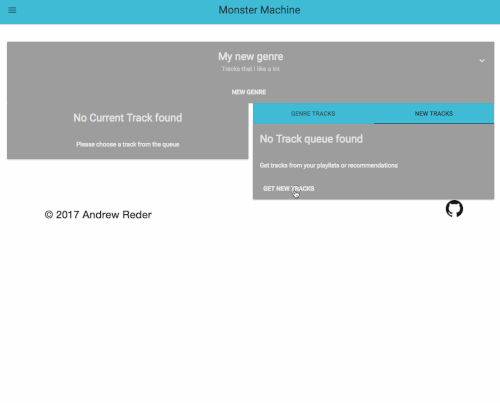
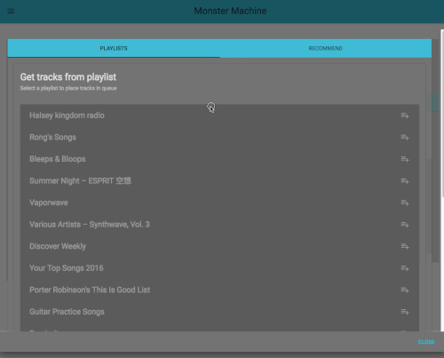

# Monster Machine Client

Monster machine is a tool that leverages the Spotify Web API to help you quickly find recommended songs. It is designed for you to create a "genre" of music, seed it with artists or songs, and Monster Machine will generate a track list for you.

The web client contained here is built in [React](https://facebook.github.io/react/) with [Redux](http://redux.js.org/) for state management, [Webpack](https://webpack.github.io/) for code bundling and consumes it's own [API](https://github.com/avidreder/monmach-api). The UI is composed of components from the [Material UI](http://www.material-ui.com/#/) library, and it uses [Ansible](https://www.ansible.com/) for deployment.

### Create a new genre

### Add tracks to your queue
#### Use existing Spotify playlist as a starting point

### Listen and rate tracks
#### Save them to the genre, or discard them

### Add a track or artist to genre "seeds"
#### If you want to be get recommendations from this

### Get recommended tracks from seeds

### Use filters

